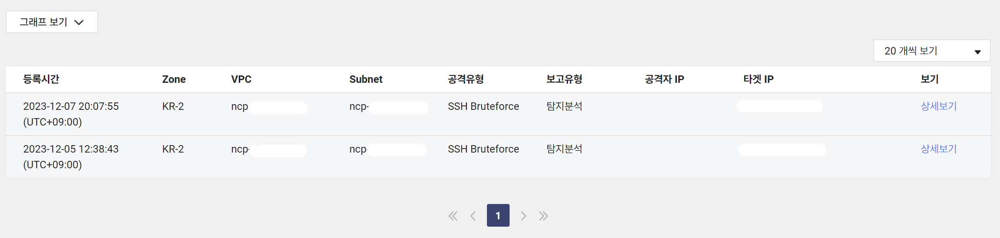

# CherryMarket-BE


## 🔎 서비스 개요

**🍒체리 마켓🍒**은 다양한 식품을 온라인으로 쉽게 구매할 수 있는 e-Commerce 웹 서비스입니다.

고객들은 맛과 품질에 중점을 둔 광범위한 식품 선택을 통해 쇼핑할 수 있으며, 키워드 검색 기능을 통해 원하는 상품을 빠르게 찾을 수 있습니다.


## 📅 프로젝트 일정

- MVP: 2023.11.30 ~ 2023.12.26
  - 1차 스프린트 : 2023.11.30 ~ 2023.12.11
  - 2차 스프린트 : 2023.12.12 ~ 2023.12.18
  - 3차 스프린트 : 2023.12.19 ~ 2023.12.26
- 리팩토링 및 추가 기능 개발: 2024.01.15. ~
    
## 📚 프로젝트 아키텍처


## 🔧 기술 스택


### ✒️ 기술적 의사 결정
<details>

<summary>MyBatis</summary>


- **MyBatis** vs JPA/Hibernate
    - MyBatis를 선택한 주된 이유는 팀원들의 기존 SQL 지식을 활용하여 러닝 커브를 최소화하기 위함이었습니다.
    - 팀원들이 이미 MyBatis를 학습한 경험이 있었고, JPA와 같은 다른 ORM 프레임워크에 대한 추가적인 학습은 프로젝트의 진행에 시간적 제약을 가져올 수 있다고 판단했습니다.
    - 따라서, 팀의 기존 경험과 프로젝트 일정을 고려하여 MyBatis를 선택했습니다.
</details>
<details>
<summary>Redis</summary>


- 인증 정보(리프레시 토큰, 본인 인증 코드 등)을 효율적으로 관리할 저장소가 필요했습니다. 이러한 인증 정보는 **생명 주기 관리를 통해 무효화**할 수 있어야 하고, 사용자 경험을 향상하기 위해 **빠른 응답 시간**을 가져야 할 것으로 생각했습니다.
- RDB를 사용하는 전통적인 접근 방식보다는, 빠른 응답 속도를 가지고, Time-To-Live 설정을 제공하는 Redis를 활용한 접근 방식을 통해 요구사항을 충족할 수 있을 것으로 판단했습니다.
- 또한, Redis의 높은 유연성은 시스템의 기능 확장 시, 추가적인 요구 사항에 신속하게 대응할 수 있을 것으로 판단해 Redis를 선택했습니다.
</details>
<details>
<summary>GitHub Actions</summary>


- **GitHub Actions** vs Jenkins
    - Jenkins는 기능은 강력하지만, 외부 서버에 의존하며 추가적인 설정 과정이 요구 되었는데, 필요한 워크플로우(SonarQube · Jacoco)를 GitHub Actions에서도 구성할 수 있었기 때문에, Jenkins의 사용이 불필요하다고 판단했습니다.
    - 그리고, GitHub Actions는 GitHub 저장소와 직접 통합되어 있어, 별도의 외부 시스템 설정이 필요하지 않고, YAML 파일을 사용하여 워크플로우를 구성함으로써, 빌드, 테스트, 배포 과정을 자동화하고 이를 직관적으로 관리할 수 있어 **GitHub Actions**를 선택했습니다.
</details>
<details>
<summary>Swagger</summary>


- **Swagger** vs GitBook
    - GitBook 또한 직관적인 UI와 다양한 문서화 도구를 지원했지만, 한글 입력 지원이 부족하고, 인터랙티브 테스팅 기능을 제공하지 않는다는 단점이 있었습니다.
    - Swagger는 OpenAPI 사양을 기반으로 한 직관적인 UI와 인터랙티브 테스팅 기능을 제공해 개발자들이 API를 쉽게 이해하고 테스트할 수 있고, 향후 RestDoc 등을 활용해 문서 관리를 자동화할 수 있다는 이점이 있었습니다.
    - 따라서, API의 개발 및 관리 측면에서 **Swagger**가 더 적합하다고 판단했습니다.
</details>

## 📗 DB ERD


## 🛠 트러블 슈팅

<details>
<summary>자동화 스크립트 봇의 취약점 탐색 시도</summary>



  - **문제**: 봇이 /admin, /phpMyAdmin, /dbAdmin, /env 등의 요청을 통해 취약점을 찾는 행위를 반복적으로 시도
  - **해결**: 로그 분석을 통해 자동화 스크립트 봇의 취약점 탐색 시도를 확인했지만, 제한된 리소스로 WAF 등 솔루션 구축이 어려워 애플리케이션 자체에서 Redis를 활용해 정상 경로("/api/**") 외에는 요청 수 제한, 임시 차단하는 RateLimitFilter를 추가해 대응

```java
    private void handleRateLimitExceeded(HttpServletResponse response, String clientIp) throws IOException {
        log.warn("[RateLimitFilter] Too many requests from [{}]", clientIp);

        redisService.extendExpireTime(RATE_LIMIT_KEY_PREFIX + clientIp, BLOCK_TIME_IN_SECONDS);

        response.setStatus(SC_TOO_MANY_REQUESTS);
        response.addIntHeader(RETRY_AFTER, BLOCK_TIME_IN_SECONDS);
        response.getWriter().write("Too many requests, please try again later.");
    }
```
</details>
<details>
<summary>데이터 접근 기술 마이그레이션</summary>

  - **상황**:
    - Mybatis 사용 시, 데이터 매핑의 복잡성과 쿼리 작성 및 수정 과정에서 Mapper 인터페이스와 XML 등 여러 파일을 동시에 관리해야 하는 번거로움
    - 쿼리를 중심으로 기능 개발을 진행하다 보니, 비즈니스 로직과 쿼리가 밀접하게 결합
    - 비즈니스 로직을 쿼리에 끼워 맞추는 형태로 개발이 진행되는 경향


  - **대처**: MyBatis에서 **JPA**로 마이그레이션 결정

    → 도메인 모델과의 일치를 통해 **객체 지향 설계의 이점을 최대화**

    → 쿼리 자동화로 **휴먼 에러 가능성 ↓** · 애플리케이션 안정성 ↑ · 개발 효율 ↑
</details>
<details>
<summary>주문 시스템의 동시성 관리</summary>

- **상황:** 동시에 같은 상품에 대한 주문 요청이 발생할 경우 등 상황에 대한 **동시성 관리** 방안이 필요

- **방법 모색 과정:** 
    - sychronized: Java에 내장된 동기화 메커니즘이지**만, 전체 메서드를 락으로 처리하는 방식은 성능 저하 우려가 크고 분산 환경에서의 확장성 낮음
    - 낙관적 또는 비관적 잠금: JPA에서 제공하는 기능을 활용할 수 있으나, 데이터베이스 리소스를 장기간 점유할 경우 성능 저하가 발생할 우려**
    - **Redisson:** 높은 성능과 분산 환경에서의 우수한 확장성을 제공 & 기존 Redis 인프라 활용 가능

- **대처:** **Redisson**을 활용하여 상품 재고 변경 시도 시, 해당 상품 코드와 동일한 이름의 락을 획득한 경우에만 작업을 진행하도록 하고, 락을 획득하지 못했을 때는 일정 시간 후 재시도하도록 구성

```java
    @DistributedLock(waitTime = 3, leaseTime = 10)
    @Transactional(propagation = Propagation.MANDATORY)
    @Retryable(retryFor = {CouldNotObtainLockException.class}, backoff = @Backoff(delay = 100, maxDelay = 500, multiplier = 2))
    public void handleUpdateInventoryInternal(Goods goods, int requestedQuantity) {
        if (goods.getInventory() < requestedQuantity) {
            throw new InsufficientStockException(INSUFFICIENT_STOCK, goods.getName());
        }

        goods.updateInventory(requestedQuantity);
        log.info("재고 업데이트 완료! / 요청 수량 : {}, 반영 후 재고 : {}", requestedQuantity, goods.getInventory());
    }
```

추가로, 락 획득 로직을 AOP를 통해 관리해 비즈니스 로직의 **가독성 유지**할 수 있도록 구성

```java
@Slf4j(topic = "distributedLockAspect")
@Aspect
@Component
@RequiredArgsConstructor
public class DistributedLockAspect {

    private final RedissonClient redissonClient;

    @Pointcut("@annotation(distributedLock)")
    public void lockPointcut(DistributedLock distributedLock) {
    }

    @Around(value = "lockPointcut(distributedLock) && args(goods, requestedQuantity)",
            argNames = "joinPoint,distributedLock,goods,requestedQuantity")
    public Object aroundLockPointcut(
            ProceedingJoinPoint joinPoint,
            DistributedLock distributedLock,
            Goods goods,
            int requestedQuantity
    ) throws Throwable {
        RLock lock = redissonClient.getLock(goods.getCode());
        boolean isLocked = false;
        try {
            isLocked = lock.tryLock(distributedLock.waitTime(), distributedLock.leaseTime(), TimeUnit.SECONDS);
            if (isLocked) {
                log.info("Lock acquired for key: {}", goods.getCode());
                return joinPoint.proceed();
            } else {
                throw new CouldNotObtainLockException("Could not obtain lock");
            }
        } finally {
            if (isLocked) {
                log.info("Releasing lock for key: {}", goods.getCode());
                lock.unlock();
            }
        }
    }
}
```
</details>
<details>
<summary>JPA 캐시와 DB 불일치 문제 해결</summary>

- **상황:** 주문 처리 로직 테스트 중, 다른 요청에 의해 동일한 상품의 **재고가 이미 소진된 상태임에도 불구**하고, **재고 부족 예외가 발생하지 않는 문제**를 발견

- **대처:** **로그 분석**을 통해, 이 문제가 재고 업데이트 이전 단계에서 이미 로드되어 캐시에 있는 엔티티를 바탕으로 재고 상태를 검증하고 있었기 때문임을 확인
  - 이에 따라, 재고 업데이트를 진행하기 전에 엔티티를 최신 상태로 갱신한 후 업데이트를 처리하고, 변경 사항을 즉시 DB에 반영하도록 작업을 구성해 데이터 불일치 예방
</details>


