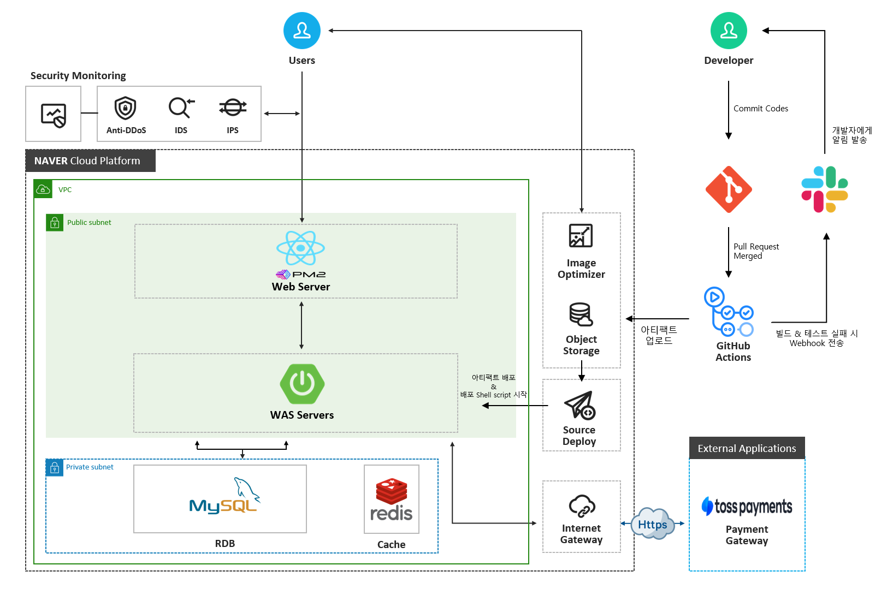
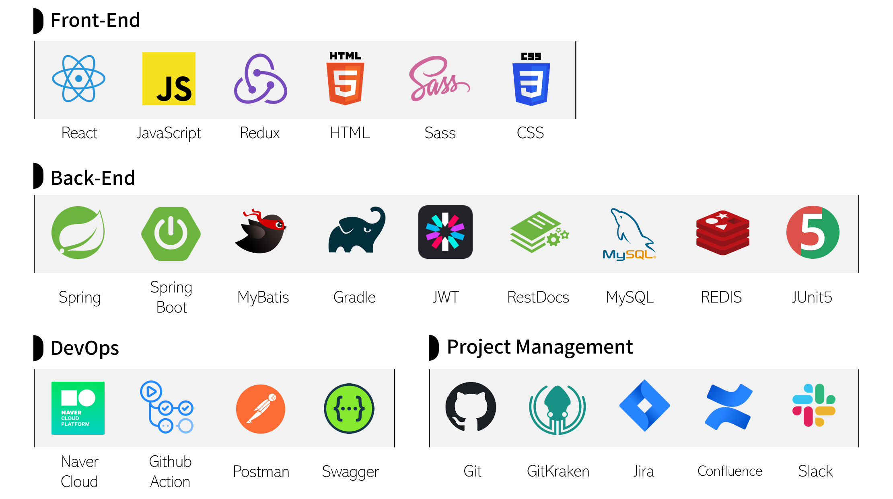
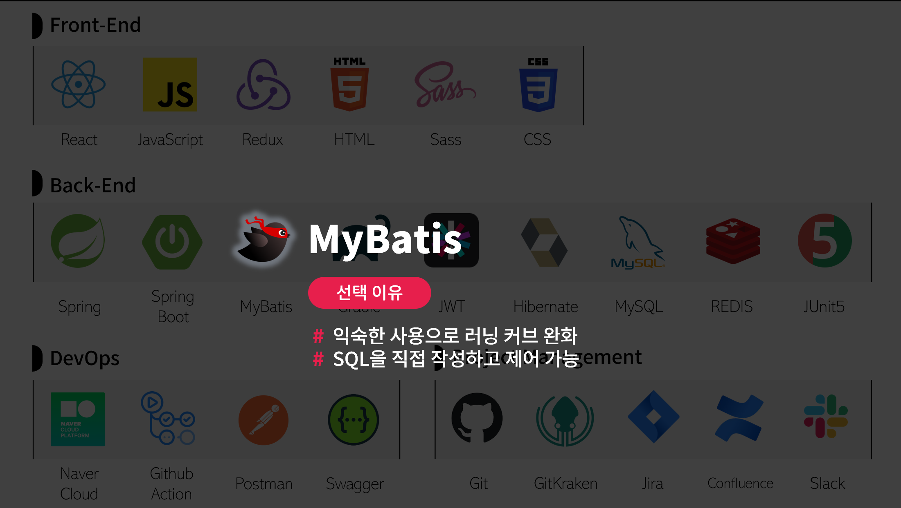
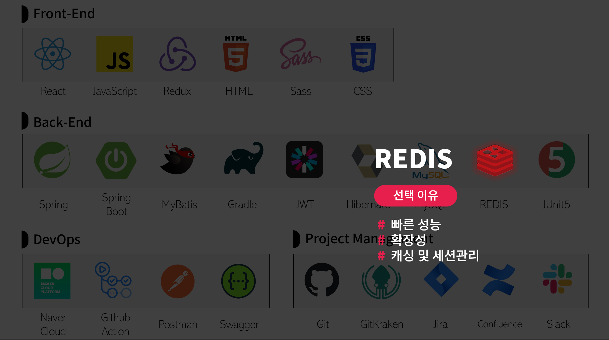
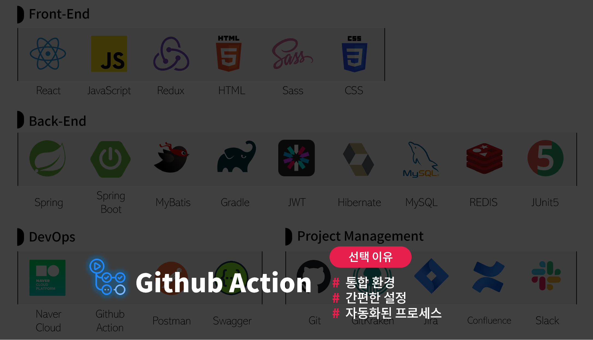
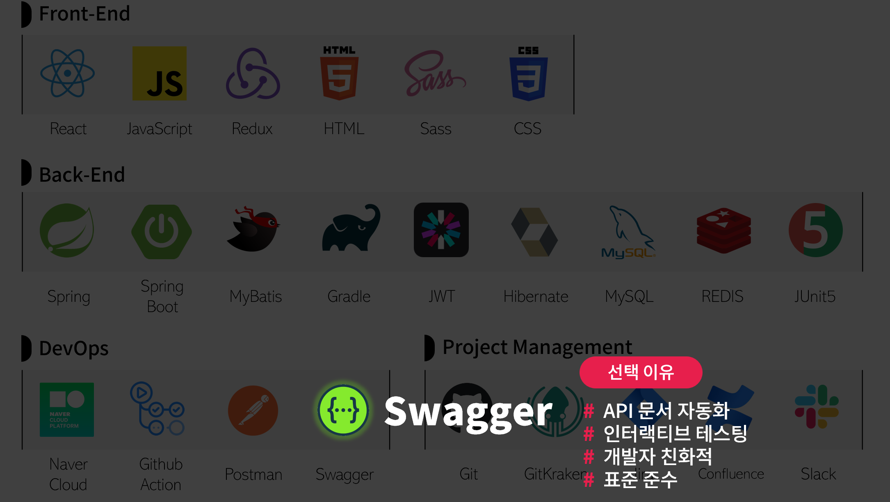
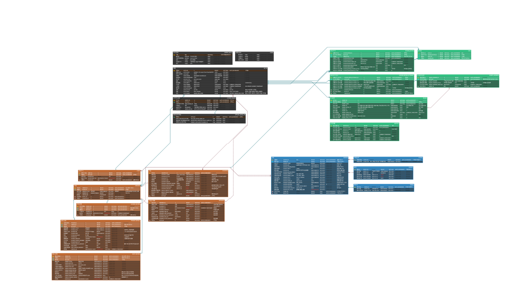

# MarketCherry 🍒

## 🔎 서비스 개요

**🍒체리 마켓🍒**은 다양한 식품을 온라인으로 쉽게 구매할 수 있는 e-Commerce 웹 서비스입니다.

고객들은 맛과 품질에 중점을 둔 광범위한 식품 선택을 통해 쇼핑할 수 있으며, 키워드 검색 기능을 통해 원하는 상품을 빠르게 찾을 수 있습니다.

## 📅 프로젝트 일정

- MVP: 2023.11.30 ~ 2023.12.26
  - 1차 스프린트 : 2023.11.30 ~ 2023.12.11
  - 2차 스프린트 : 2023.12.12 ~ 2023.12.18
  - 3차 스프린트 : 2023.12.19 ~ 2023.12.26
- 리팩토링 및 추가 기능 개발: 2024.01.15. ~
    
## 📚 프로젝트 아키텍처

## 🔧 기술 스택

### ✒️ 기술적 의사 결정

- **MyBatis** vs JPA/Hibernate
    - MyBatis를 선택한 주된 이유는 러닝 커브를 최소화하기 위함이었습니다.
    - 팀원들이 이미 MyBatis를 학습한 경험이 있었고, JPA와 같은 다른 ORM 프레임워크에 대한 추가적인 학습은 프로젝트의 진행에 시간적 제약을 가져올 수 있다고 판단했습니다.
    - 따라서, 팀의 기존 경험과 프로젝트 일정을 고려하여 MyBatis를 선택했습니다.
    - ※ 

- **Redis**
- 인증 정보(리프레시 토큰, 본인 인증 코드 등)을 효율적으로 관리할 저장소가 필요했습니다. 이러한 인증 정보는 **생명 주기 관리를 통해 무효화**할 수 있어야 하고, 사용자 경험을 향상하기 위해 **빠른 응답 시간**을 가져야 할 것으로 생각했습니다.
- RDB를 사용하는 전통적인 접근 방식보다는, 빠른 응답 속도를 가지고, Time-To-Live 설정을 제공하는 Redis를 활용한 접근 방식을 통해 요구사항을 충족할 수 있을 것으로 판단했습니다.
- 또한, Redis의 높은 유연성은 시스템의 기능 확장 시, 추가적인 요구 사항에 신속하게 대응할 수 있을 것으로 판단해 Redis를 선택했습니다.

- **GitHub Actions** vs Jenkins
    - Jenkins는 기능은 강력하지만, 외부 서버에 의존하며 추가적인 설정 과정이 요구 되었는데, 필요한 워크플로우(SonarQube · Jacoco)를 GitHub Actions에서도 구성할 수 있었기 때문에, Jenkins의 사용이 불필요하다고 판단했습니다.
    - 그리고, GitHub Actions는 GitHub 저장소와 직접 통합되어 있어, 별도의 외부 시스템 설정이 필요하지 않고, YAML 파일을 사용하여 워크플로우를 구성함으로써, 빌드, 테스트, 배포 과정을 자동화하고 이를 직관적으로 관리할 수 있어 **GitHub Actions**를 선택했습니다.

- **Swagger** vs GitBook
    - GitBook 또한 직관적인 UI와 다양한 문서화 도구를 지원했지만, 한글 입력 지원이 부족하고, 인터랙티브 테스팅 기능을 제공하지 않는다는 단점이 있었습니다.
    - Swagger는 OpenAPI 사양을 기반으로 한 직관적인 UI와 인터랙티브 테스팅 기능을 제공해 개발자들이 API를 쉽게 이해하고 테스트할 수 있고, 향후 RestDoc 등을 활용해 문서 관리를 자동화할 수 있다는 이점이 있었습니다.
    - 따라서, API의 개발 및 관리 측면에서 **Swagger**가 더 적합하다고 판단했습니다.

## 📗 DB ERD

