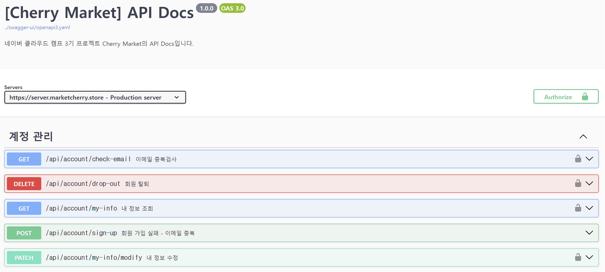
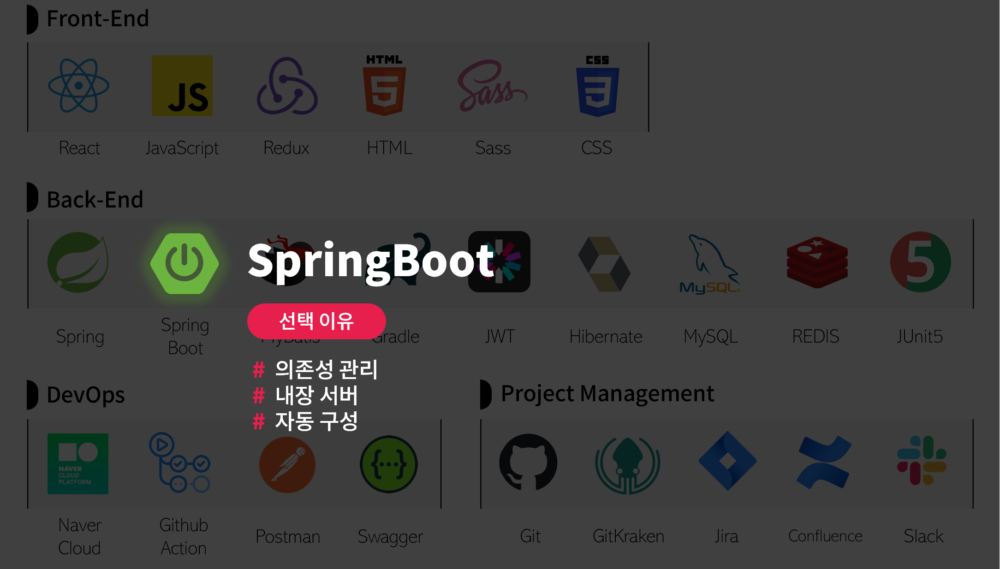
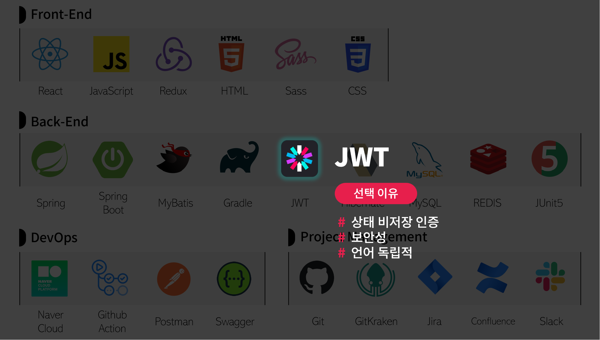

# CherryMarket-BE


## 🔎 서비스 개요

**🍒체리 마켓🍒**은 다양한 식품을 온라인으로 쉽게 구매할 수 있는 e-Commerce 웹 서비스입니다.

고객들은 맛과 품질에 중점을 둔 광범위한 식품 선택을 통해 쇼핑할 수 있으며, 키워드 검색 기능을 통해 원하는 상품을 빠르게 찾을 수 있습니다.


_(실제로 운영되는 서비스가 아닙니다.)_

---

## 📅 프로젝트 일정

- MVP: 2023.11.30 ~ 2023.12.26
  - 1차 스프린트 : 2023.11.30 ~ 2023.12.11
  - 2차 스프린트 : 2023.12.12 ~ 2023.12.18
  - 3차 스프린트 : 2023.12.19 ~ 2023.12.26

    
## 📚 프로젝트 아키텍처


## 📙 API 명세서

[더 자세한 API 문서 보러가기](http://docs.marketcherry.store/cherry-api-docs/dist/swagger-ui.html)


## 📗 DB ERD


---

## 🔧 기술 스택


### 📌 선택 이유
<details>
<summary>Spring Boot</summary>


- **의존성 관리**: 자동화된 의존성 관리를 통해 프로젝트 구성을 단순화
- **내장 서버**: 내장 서버 지원으로 별도 서버 설정 필요 없이 바로 개발 시작 가능
- **자동 구성**: 스프링의 다양한 기능을 자동으로 구성 빠른 개발 환경 조성
</details>
<details>
<summary>MyBatis</summary>


- SQL 익숙한 사용으로 러닝 커브 완화
- **SQL 제어**: SQL 개발자가 을 직접 작성하고 제어 가능
</details>

<details>
<summary>Redis</summary>


 - **빠른 성능**: 인메모리 데이터 스토어로 빠른 데이터 읽기 쓰기 속도 제공
 - **확장성**: 쉬운 스케일링 및 데이터 분산 처리 지원
 - **캐싱 및 세션 관리**: 효과적인 캐싱 솔루션 세션 관리 용이
</details>
<details>
<summary>JWT</summary>


- 상태 비저장 인증: 서버의 세션 관리 필요 없이 클라이언트 측에서 인증 관리
- 보안성: 정보의 암호화 및 서명을 통한 높은 보안성 제공
- 언어 독립적: 다양한 프로그래밍 언어 및 플랫폼에서 사용 가능
</details>
<details>
<summary>Swagger</summary>


- **API 문서 자동화**: REST API 문서를 자동으로 생성 및 관리
- **인터랙티브 테스팅**: API 엔드포인트에 대한 직접적인 테스트 지원
- **개발자 친화적**: UI API 직관적인 로 구조 이해 및 협업 용이
- **표준 준수**: OpenAPI 사양 준수 / 다양한 플랫폼과의 호환성
</details>
<details>
<summary>GitHub Actions</summary>


- **통합 환경**: GitHub , CI/CD 저장소와 직접 통합되어 별도의 시스템 설정 불필요
- **간편한 설정**: YAML 파일을 통한 간단한 워크플로우 구성
- **자동화된 프로세스**: Push, Pull Request 시 자동화된 빌드/테스트/배포
</details>

---

## 🛠 트러블 슈팅
<details>
<summary>자동화 스크립트 봇의 취약점 탐색 시도</summary>


  - **문제**: 봇이 /admin, /phpMyAdmin, /dbAdmin, /env 등의 요청을 통해 취약점을 찾는 행위를 반복적으로 시도
  - **해결**: 로그 분석을 통해 자동화 스크립트 봇의 취약점 탐색 시도를 확인했지만, 제한된 리소스로 WAF 등 솔루션 구축이 어려워 애플리케이션 자체에서 Redis를 활용해 정상 경로("/api/**") 외에는 요청 수 제한, 임시 차단하는 RateLimitFilter를 추가해 대응했습니다.

</details>
<details>
<summary>데이터 접근 기술 마이그레이션</summary>

  - **상황**:
    - Mybatis 사용 시, 데이터 매핑의 복잡성과 쿼리 작성 및 수정 과정에서 Mapper 인터페이스와 XML 등 여러 파일을 동시에 관리해야 하는 번거로움

    - 쿼리를 중심으로 기능 개발을 진행하다 보니, 비즈니스 로직과 쿼리가 밀접하게 결합
    - 비즈니스 로직을 쿼리에 끼워 맞추는 형태로 개발이 진행되는 경향


  - **대처**: MyBatis에서 **JPA**로 마이그레이션 결정

    → 도메인 모델과의 일치를 통해 객체 지향 설계의 이점을 최대화

    → 쿼리 자동화로 **휴먼 에러 가능성 ↓** · 애플리케이션 안정성 ↑ · 개발 효율 ↑
</details>
<details>
<summary>주문 시스템의 동시성 관리</summary>

- **상황:** 동시에 같은 상품에 대한 주문 요청이 발생할 경우 등 상황에 대한 **동시성 관리** 방안이 필요

- **방법 모색 과정:** 
    - sychronized: Java에 내장된 동기화 메커니즘이지만, 전체 메서드를 락으로 처리하는 방식은 성능 저하 우려가 크고 분산 환경에서의 확장성 낮음
    - 낙관적 또는 비관적 잠금: JPA에서 제공하는 기능 활용 가능, 데이터베이스 리소스를 장기간 점유할 경우 성능 저하가 발생할 수 있다는 단점
    - **Redisson:** 높은 성능과 분산 환경에서의 우수한 확장성을 제공, 기존 Redis 인프라 활용 가능

- **대처:** **Redisson**을 활용하여 상품 재고 변경 시도 시, 해당 상품 코드와 동일한 이름의 락을 획득한 경우에만 작업을 진행하도록 하고, 락을 획득하지 못했을 때는 일정 시간 후 재시도하도록 구성

```java
    @DistributedLock(waitTime = 3, leaseTime = 10)
    @Transactional(propagation = Propagation.MANDATORY)
    @Retryable(retryFor = {CouldNotObtainLockException.class}, backoff = @Backoff(delay = 100, maxDelay = 500, multiplier = 2))
    public void handleUpdateInventoryInternal(Goods goods, int requestedQuantity) {
        if (goods.getInventory() < requestedQuantity) {
            throw new InsufficientStockException(INSUFFICIENT_STOCK, goods.getName());
        }

        goods.updateInventory(requestedQuantity);
        log.info("재고 업데이트 완료! / 요청 수량 : {}, 반영 후 재고 : {}", requestedQuantity, goods.getInventory());
    }
```

추가로, 락 획득 로직을 AOP를 통해 관리해 비즈니스 로직의 **가독성 유지**할 수 있도록 구성했습니다.

```java
@Slf4j(topic = "distributedLockAspect")
@Aspect
@Component
@RequiredArgsConstructor
public class DistributedLockAspect {

    private final RedissonClient redissonClient;

    @Pointcut("@annotation(distributedLock)")
    public void lockPointcut(DistributedLock distributedLock) {
    }

    @Around(value = "lockPointcut(distributedLock) && args(goods, requestedQuantity)",
            argNames = "joinPoint,distributedLock,goods,requestedQuantity")
    public Object aroundLockPointcut(
            ProceedingJoinPoint joinPoint,
            DistributedLock distributedLock,
            Goods goods,
            int requestedQuantity
    ) throws Throwable {
        RLock lock = redissonClient.getLock(goods.getCode());
        boolean isLocked = false;
        try {
            isLocked = lock.tryLock(distributedLock.waitTime(), distributedLock.leaseTime(), TimeUnit.SECONDS);
            if (isLocked) {
                log.info("Lock acquired for key: {}", goods.getCode());
                return joinPoint.proceed();
            } else {
                throw new CouldNotObtainLockException("Could not obtain lock");
            }
        } finally {
            if (isLocked) {
                log.info("Releasing lock for key: {}", goods.getCode());
                lock.unlock();
            }
        }
    }
}
```
</details>

<details>
<summary>JPA 캐시와 DB 불일치 문제 해결</summary>

- **상황:** 주문 처리 로직 테스트 중, 다른 요청에 의해 동일한 상품의 재고가 이미 소진된 상태임에도 불구하고, 재고 부족 예외가 발생하지 않는 문제를 발견했습니다.

- **대처:** 로그 분석을 통해, 이 문제가 재고 업데이트 이전 단계에서 이미 로드되어 캐시에 있는 엔티티를 바탕으로 재고 상태를 검증하고 있었기 때문임을 확인했습니다. 
  - 이에 따라, 재고 업데이트를 진행하기 전에 엔티티를 최신 상태로 갱신한 후 업데이트를 처리하고, 변경 사항을 즉시 DB에 반영하도록 작업을 구성해 데이터 불일치 예방했습니다.
</details>


